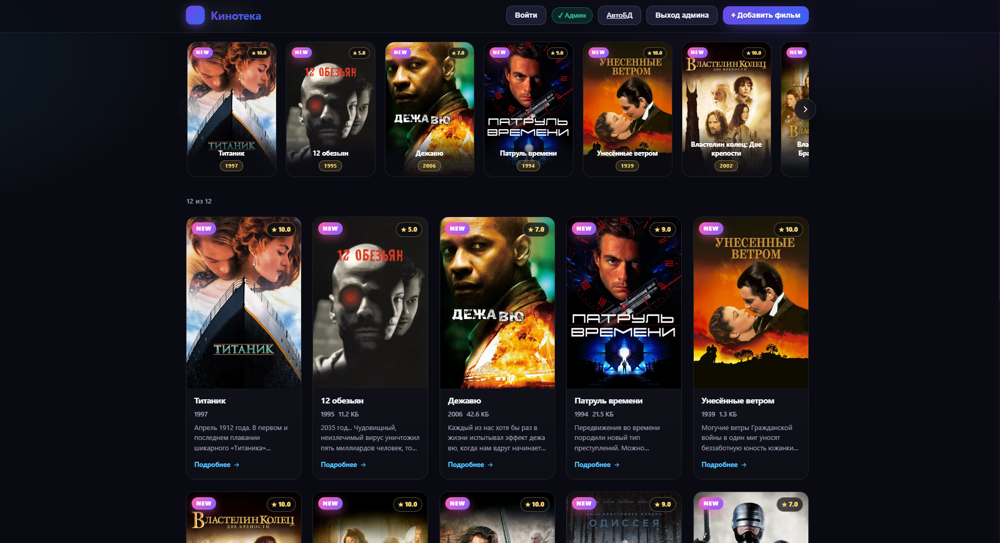
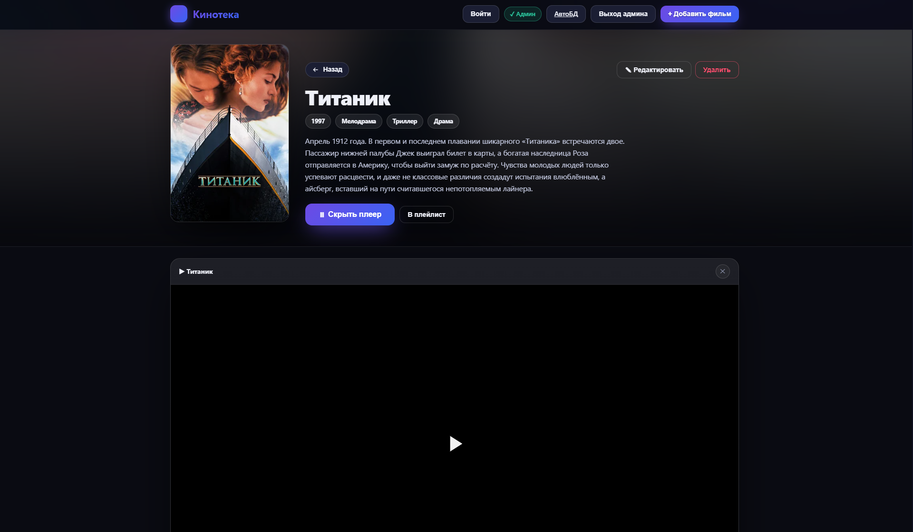
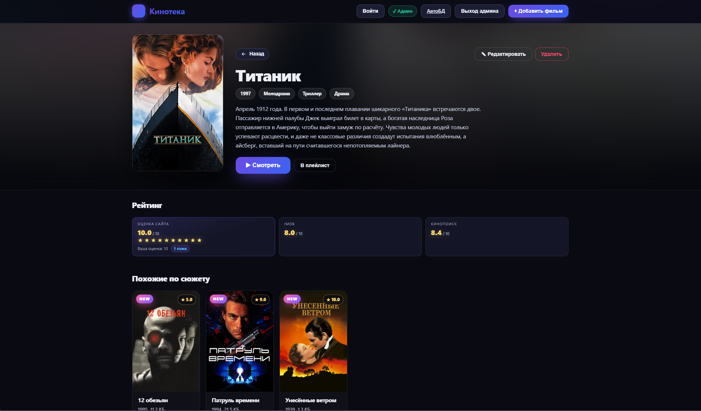
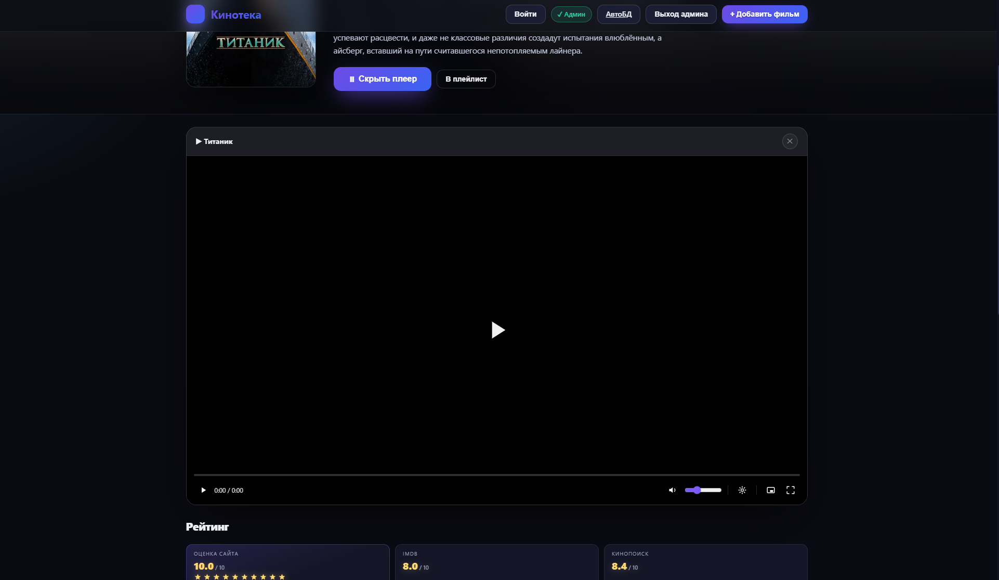

# Кинотека — домашняя медиатека со встроенным плеером

Кинотека — портативный проект для просмотра собственной коллекции фильмов:
React 18 + TypeScript (Vite) на фронте и Express на бэкенде. Всё нужное лежит
в одной папке — можно скопировать её целиком на другой компьютер.

Сервер хранит фильмы и пользователей в простых JSON-файлах, отдаёт видео
стримом (работает перемотка) и позволяет наполнять каталог автоматически из
Кинопоиска через отдельную страницу «АвтоБД».

## Скриншоты









---

## Содержание

1. [Возможности](#возможности)
2. [Как это устроено](#как-это-устроено)
3. [Структура проекта](#структура-проекта)
4. [Запуск](#запуск)
5. [Наполнение базы](#наполнение-базы)
6. [АвтоБД (импорт из Кинопоиска)](#автобд-импорт-из-кинопоиска)
7. [Пользователи и личный кабинет](#пользователи-и-личный-кабинет)
8. [Администрирование](#администрирование)
9. [Перенос на другой компьютер](#перенос-на-другой-компьютер)
10. [Настройка и безопасность](#настройка-и-безопасность)

---

## Возможности

### Каталог
- Сетка карточек с постером, названием, годом, размером и оценкой.
- Поиск по названию, описанию, тегам и году (не чувствителен к регистру).
- Фильтр по жанру — на главной панели или по клику на жанр на странице фильма
  (ведёт на `/genre/<название>` и показывает все фильмы этого жанра).
- Сортировка: дата добавления, год, название, размер, оценка сайта, IMDB, Кинопоиск
  (по возрастанию/убыванию).
- Лента «Новинки» — компактные плитки недавно добавленных фильмов.

### Страница фильма
- Большой постер, год, жанры (кликабельны), размер, описание.
- Собственный HTML5-плеер в стилистике сайта: кнопки управления, перемотка
  с буфером (сервер поддерживает `Range`-запросы), громкость, скорость
  воспроизведения, полный экран и картинка-в-картинке, горячие клавиши
  (Space/K — пауза, ←/→ — перемотка, ↑/↓ — громкость, M — звук, F —
  полный экран, Esc — закрытие), автопрятание панели при просмотре.
  Двойной клик по видео — полный экран с запуском; повторный двойной клик —
  пауза и выход из полного экрана. Громкость меняется колёсиком мыши над
  иконкой громкости (или в любом месте в полноэкранном режиме) с показом
  процента по центру экрана.
- Качество и субтитры: для потока по ссылке (HLS `.m3u8`) меню качества и
  субтитров появляются автоматически, если они есть у источника; для
  локального файла кнопка субтитров видна, только если прикрепить файл
  субтитров или они встроены в видео. MKV/AVI браузер не проигрывает —
  плеер предупредит об этом.
- Рейтинги: собственная оценка сайта по звёздам (1–10), IMDB и Кинопоиск.
- Счётчик голосов с русскими окончаниями («голос / голоса / голосов»).
- Подборка «Похожие по сюжету» — анализирует пересечение слов в описаниях
  и общие жанр/год (см. `src/similar.ts`).
- Комментарии с ответами (вложенность), редактированием и удалением.
  Администратор, кликнув по нику автора, открывает меню управления
  пользователем (уведомить, блокировка, удаление аккаунта).

### Пользователи
- Регистрация по почте с кодом (имитация — код печатается в консоль сервера).
- Вход по паролю, сессия по токену (7 дней).
- Легко-вход администратора тем же логином `Admin`.
- Уведомления: ответы на ваши комментарии и личные сообщения администратора,
  с удалением по одному.
- Личный кабинет с возможностью удалить свой аккаунт без следов.

---

## Как это устроено

**Фронтенд** — SPA на React Router. Все страницы:
- `/` — главная (каталог с поиском/фильтрами).
- `/genre/:genre` — фильтр по жанру (тот же каталог с применённым жанром).
- `/movie/:id` — страница фильма.
- `/cabinet` — личный кабинет пользователя.
- `/admin` — АвтоБД (наполнение из Кинопоиска), доступна администратору.

**Бэкенд** — Express. Ключевые моменты:
- `data/movies.json` и `data/users.json` — хранение в JSON.
- Сервер **кеширует** прочитанные файлы по времени модификации: пока файл не
  менялся, база не перечитывается с диска на каждый запрос. Это заметно ускоряет
  работу каталога и списка фильмов.
- Аккаунт пользователя хранит просмотры, плейлисты и уведомления. Удаление
  аккаунта (самим пользователем или админом) полностью убирает его следы:
  удаляются запись и аватар, а его комментарии остаются в базе, но теряют
  привязку к аккаунту и выглядят как комментарии гостя.
- Заблокированные админом пользователи могут входить на сайт, но не могут
  оставлять комментарии.
- Видео отдаётся статикой с заголовком `Accept-Ranges: bytes` — браузер может
  перематывать и доигрывать стрим.
- У фильма видео — **локальный файл или внешняя ссылка**. В формах добавления/
  редактирования можно либо загрузить файл, либо вставить URL потока
  (например, HLS `.m3u8`); при замене видео ссылкой старый локальный файл
  удаляется. HLS проигрывается через `hls.js`, в остальных случаях — нативно.
- Субтитры (необязательно): формат `.srt` автоматически конвертируется
  в `.vtt` и сохраняется рядом с видео как `media/<id>/subtitles.vtt`.
- Пароль администратора задаётся через переменную окружения `ADMIN_PASSWORD`
  (по умолчанию `admin`).

---

## Структура проекта

```
Project1/
├── src/               # React-приложение (TypeScript)
│   ├── components/    # MovieCard, MovieGrid, GenreTagInput, Stars, Player, модалки…
│   ├── pages/         # Home, MoviePage, Cabinet, AutoDb
│   ├── App.tsx        # роутинг и шапка
│   ├── api.ts         # клиент всех API-запросов
│   ├── colors.ts      # извлечение цветов постера для градиента карточки
│   ├── similar.ts     # алгоритм «похожие по сюжету»
│   ├── admin.tsx      # контекст администратора
│   ├── user.tsx       # контекст пользователя + модалка входа/регистрации
│   └── styles.css     # все стили
├── server/
│   ├── server.js      # Express: API, БД, раздача видео, пользователи
│   └── kinopoisk.js   # модуль импорта из Кинопоиска (АвтоБД)
├── data/              # movies.json, users.json, kinopoisk_config.json (создаются сами)
├── media/             # видео/постеры фильмов + media/_avatars (создаются сами)
├── dist/              # собранный фронтенд (создаётся командой build)
├── start.bat          # быстрый запуск (двойной клик)
├── package.json
└── README.md
```

---

## Запуск

Самый простой способ — двойной клик по `start.bat`. В архиве уже есть
все зависимости и собранный фронтенд, поэтому сайт поднимется сразу и
откроется браузер на `http://localhost:3000`. Если чего-то не хватает
(например, вы скачали только исходники без папок `node_modules`/`dist`),
скрипт сам доустановит зависимости и соберёт фронт.

Вручную:

1. Установите зависимости (один раз):
   ```
   npm install
   ```
2. Режим разработки с горячей перезагрузкой:
   ```
   npm run dev
   ```
   Фронт поднимется на `http://localhost:5173` (проксирует `/api` на сервер).
3. Продакшен (сборка + сервер на `http://localhost:3000`):
   ```
   npm start
   ```
   Либо отдельно: `npm run build`, затем `node server/server.js`.

---

## Наполнение базы

1. Войдите как администратор (кнопка «Войти» → логин `Admin` → пароль `admin`),
   либо сразу нажмите «+ Добавить фильм» — войти предложит автоматически.
2. Форма «Добавить фильм»:
   - **Название** (обязательно).
   - **Год** — только цифры, до 4 знаков.
   - **Жанры** — вводите жанр и нажимайте пробел/Enter — введённое становится
     плашкой. Жанров можно несколько; клики по ним на странице фильма ведут на
     фильтры.
   - **Описание** — используется для подборки похожих.
   - **Теги** — видны только в поиске. Вводите тег и жмите пробел/Enter — тег
     становится плашкой (не через запятую). При поиске теги ищутся
     подстрокой.
   - Оценки **IMDB** и **Кинопоиск** — числа до 10.
   - **Видеофайл** (обязательно) — mp4/webm/mov/mkv/avi и т.п.
   - **Постер** (необязательно).
3. Файлы копируются в `media/<id>/`, данные — в `data/movies.json`.

Форма «✎ Редактировать» на странице фильма позволяет изменить все поля и/или
заменить видео и постер.

> Импортированные из Кинопоиска фильмы не имеют видео — на карточке показан
> чип «Видео ещё нет». Видео добавляется вручную через «✎ Редактировать».

---

## АвтоБД (импорт из Кинопоиска)

Страница `/admin` (кнопка «АвтоБД» в шапке) позволяет наполнять коллекцию
без ручного поиска и скачивания видео.

1. Вставьте API-ключ с [kinopoiskapiunofficial.tech](https://kinopoiskapiunofficial.tech)
   (бесплатный) и нажмите «Сохранить». Ключ хранится только на вашем сервере
   в `data/kinopoisk_config.json`.
2. Настройте фильтры:
   - **По жанру и годам**: жанр, тип (фильм/сериал/…), диапазон лет, сортировка,
     минимальный рейтинг.
   - **По ключевым словам**: слово из названия (жанр/тип/годы скрываются).
   - «Сколько собрать (макс.)» — ограничение объёма импорта.
3. «Предпросмотр» — показывает найденные фильмы (постер, название, год, оценки,
   жанры). Можно выбрать отдельные и «Добавить выбранные (N)» либо «Собрать все».
4. Идёт задача с прогрессом: на каких страницах API, сколько добавлено/уже было
   в базе/ошибок. Задачу можно отменить.

Особенности реализации:
- Пагинация по `totalPages` (но не более 20 страниц API). Запросы выше
  возвращают ошибку 400 — модуль это учитывает.
- Рейтинг с десятичной запятой нормализуется в точку, иначе API возвращает 400.
- Импортированные фильмы помечаются `fromKinopoisk` и получают `kinopoiskId`.
  Повторный сбор не дублирует уже существующие.

---

## Пользователи и личный кабинет

- Кнопка «Войти» в шапке открывает форму входа/регистрации.
- **Регистрация**: имя/ник, телефон (необязательно), почта → «Получить код».
  Код (6 цифр) печатается в консоль сервера (реальная отправка письма не
  настроена). Введите код и придумайте пароль (от 4 символов).
- **Вход**: почта и пароль. Логин `Admin` с паролем администратора открывает
  режим админа.
- После входа в шапке — имя с аватаром и счётчиком непрочитанных уведомлений;
  клик ведёт в кабинет.

Вкладки кабинета (`/cabinet`):
- **Профиль** — фото, имя, почта, телефон, а также кнопка «Удалить аккаунт»:
  аккаунт удаляется полностью и безвозвратно (вместе с аватаром), а ваши
  комментарии остаются как комментарии незарегистрированного пользователя.
  В профиле также виден бейдж «Заблокирован», если админ ограничил аккаунт.
- **Просмотрено** — фильмы, которые вы открывали на «Смотреть»; можно убрать
  по одному или очистить всё, а также посмотреть фильм снова.
- **Плейлисты** — создание/переименование/удаление и просмотр содержимого.
  Фильм в плейлист добавляется кнопкой «В плейлист» на его странице.
- **Комментарии** — ваши комментарии со ссылками на фильмы и удалением.

Уведомления приходят, когда кто-то отвечает на ваш комментарий, а также когда
администратор пишет вам лично (отправитель «Администратор»). Колокольчик в
шапке показывает непрочитанные; каждое уведомление можно удалить отдельной
кнопкой «✕», а «Прочитать все» помечает всё сразу.

---

## Администрирование

Режим администратора включается входом с логином `Admin` (или парольной
кнопкой) — после этого в шапке появляются «АвтоБД», «Выход админа»
и «+ Добавить фильм».

Администратор может:
- добавлять, редактировать, удалять фильмы;
  - при добавлении/редактировании фильма видео можно загрузить файлом
    **или** указать ссылкой (URL), а субтитры — прикрепить по желанию;
- удалять любые комментарии;
- наполнять базу через АвтоБД;
- на странице фильма видеть кнопки «✎ Редактировать» и «Удалить»;
- управлять пользователями: на странице фильма кликните по нику автора
  комментария (ник подчёркнут пунктиром) — откроется меню:
  - **Уведомить** — отправить пользователю личное сообщение; оно появится
    у него в уведомлениях (отправитель «Администратор»);
  - **Заблокировать / Разблокировать** — заблокированный пользователь больше
    не может оставлять комментарии, пока его не разблокируют (входить и
    смотреть фильмы при этом можно);
  - **Удалить** — удалить аккаунт пользователя безвозвратно (с подтверждением):
    аккаунт и аватар исчезают, а его комментарии остаются как комментарии
    незарегистрированного пользователя.

---

## Перенос на другой компьютер

1. Скопируйте папку `Project1` целиком, включая `data/` и `media/`.
2. Установите Node.js.
3. `npm install`, затем `npm start` (или двойной клик по `start.bat`).

> ВАЖНО: не удаляйте `data/kinopoisk_config.json`, если хотите сохранить
> настроенный API-ключ Кинопоиска.

---

## Настройка и безопасность

- **Пароль администратора**: по умолчанию `admin` (задаётся в
  `server/server.js`, строка `ADMIN_PASSWORD`). Для продакшена задайте
  переменную окружения `ADMIN_PASSWORD`.
- **Порт**: `process.env.PORT || 3000`.
- **Лимиты загрузки**: видео до 30 ГБ, аватар до 6 МБ.
- Файлы и пароли: пароли пользователей хранятся как scrypt-хеши с солью.
- Заголовки: видео отдаётся с `Accept-Ranges: bytes` для перемотки.
